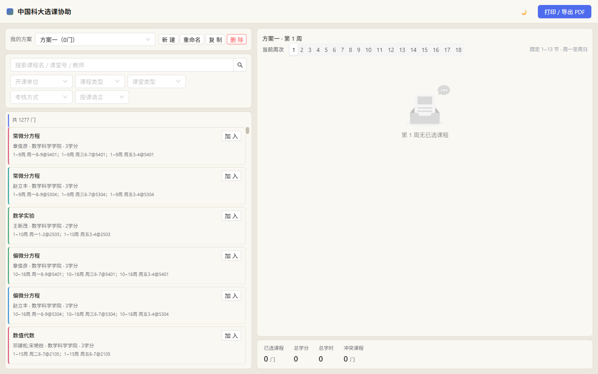

# class-arrange · 中国科大排课协助

一个帮助 USTC 学生在线排课的轻量前端。每学期从教务系统导出开课 Excel →
脚本转成 TS → 浏览器按多维度筛选、时间冲突检测生成可视化课表，并支持 icourse.club
评分查询（多班次各自评分）。



---

## 功能

- **课程池**：按开课单位、课程类型、课堂类型、考核方式、授课语言筛选；支持搜索课程名 / 课堂号 / 教师
- **虚拟滚动列表**：940 门课卡顿问题通过 `react-window` + 动态行高彻底解决
- **冲突检测**：自动检测已选课程时间冲突，标记冲突课程
- **周课表**：按节次（1–13）×星期（周一至周日）渲染；支持切换周次查看；全部周次视图按无调休、无日期变更的标准教学周展示
- **已选课程管理**：状态栏的已选课程入口可打开管理界面，集中移除、查看和补选课程
- **排课枚举**：当一门课选了多个不同 group 时，自动枚举所有可能的排课组合，按冲突数从少到多列出最多 8 种方案，课表与状态栏默认显示冲突最少的一种，可在小卡片间切换
- **多方案**：本地保存多个选课方案，互相独立
- **本地持久化**：方案数据存 `localStorage`，刷新不丢失
- **打印导出**：浏览器原生打印 / 导出 PDF
- **明暗主题**：跟随系统 + 手动切换
- **icourse 评分**：卡片与详情弹窗内显示每门课的 icourse.club 评分（同时间不同老师各自展示）

---

## 技术栈

| 类别 | 选型 |
|---|---|
| 框架 | React 19 + TypeScript 6 |
| 构建 | Vite 8 |
| UI 库 | Ant Design 6 |
| 虚拟滚动 | react-window 2.x（`useDynamicRowHeight`） |
| 状态 | React Context + `useReducer` |
| Python 数据脚本 | uv + openpyxl / requests / tqdm |

---

## 项目结构

```
class-arrange/
├── LICENSE.md                    # 项目许可证与第三方 AGPL v3 代码说明
├── index.html
├── package.json                  # 前端依赖（pnpm）
├── pyproject.toml                # Python 依赖（uv）
├── tsconfig*.json
├── vite.config.ts
│
├── src/
│   ├── App.tsx                   # 应用根、主题、布局
│   ├── data/
│   │   ├── courses.ts            # 由 scripts/excel_to_ts.py 自动生成
│   │   ├── icourseRatings.ts     # 由 scripts/ratings_to_ts.py 自动生成
│   │   └── index.ts
│   ├── types/                    # CourseSection / CourseGroup / ScheduleSlot / Plan
│   ├── components/               # 课程池 / 课表 / 弹窗 / 筛选 / 方案等 UI
│   ├── hooks/                    # useFilteredCourses / useConflicts / useWeekGrid
│   ├── store/                    # plansContext + plansReducer
│   ├── utils/                    # courseGroup / conflict / grid / weeks / courseColor / icourseRating …
│   ├── constants/                # grid / filterOptions
│   └── styles/                   # tokens / print
│
├── scripts/
│   ├── excel_to_ts.py            # 开课 Excel → src/data/courses.ts
│   └── ratings_to_ts.py          # icourse 评分 JSON → src/data/icourseRatings.ts
│
└── icourse_spider/               # icourse.club 评分爬虫
    ├── spider.py                 # 多进程爬取课程名 + 教师 + 评分
    ├── lesson_match.py           # 匹配 key 工具（name + '#' + sorted(teachers)）
    └── course_rating.json        # 爬取的最新评分数据（被 git 跟踪）
```

---

## 快速开始

> 环境要求：[Node.js](https://nodejs.org/) 20+、`pnpm`、`uv`（[Astral](https://docs.astral.sh/uv/)）、Python 3.12+。

### 1. 安装前端依赖

```powershell
pnpm install
```

### 2. 安装 Python 依赖（用于数据脚本和爬虫）

```powershell
uv sync --group spider
```

> 包含：
> - `openpyxl`：把开课 Excel 转成 TS（`scripts/excel_to_ts.py`）
> - `requests`、`tqdm`：icourse 评分爬虫（`icourse_spider/spider.py`）

### 3. 启动开发服务器

```powershell
pnpm dev
```

浏览器打开 <http://localhost:5173>。

### 4. 其它常用命令

```powershell
pnpm build         # 生产构建（含 tsc 类型检查）
pnpm lint          # oxlint
pnpm preview       # 本地预览生产构建
```

---

## 数据更新流程

### 更新开课 Excel

把新学期的 `全校开课查询结果.xlsx` 放到项目根目录，然后：

```powershell
uv run python scripts/excel_to_ts.py
```

会重新生成 `src/data/courses.ts`。脚本会自动：

- 解析"时间地点"字段（支持 `1~9周`、`1,3,5周`、`2,7~9(单)周`、`8~10(双)周` 等格式）
- 拆分多老师字段（`,` `，` `、` `/`）
- 报告时间地点解析失败的行

可选：显式指定 Excel 路径：

```powershell
uv run python scripts/excel_to_ts.py "path/to/开课查询.xlsx"
```

### 更新 icourse 评分

> 评分数据每学期变化不大，建议新学期开始时跑一次，平时不必。

```powershell
# 1. 爬取最新评分（约 30 分钟，~18.6k 门课）
uv run python icourse_spider/spider.py

# 2. 转换为前端数据
uv run python scripts/ratings_to_ts.py
```

`ratings_to_ts.py` 按 section（课堂号）维度精确匹配：

```
key = courseName + '#' + ','.join(sorted(teachers))
```

未在 icourse 上出现的课不会出现在 `icourseRatings.ts` 里，前端对应位置不显示任何评分。

匹配命中率一般在 60–70%（1277 sections 中约 880 条）。

---

## 关键设计决策

### 选课单元（CourseGroup）

把"同课程号 + 时间完全一致"的多个班次合并成一个 `CourseGroup` 对象。学生排课时不纠结老师，同时间同课的不同班次视为同一选课对象。同课程号但时间不同的班次各自独立成组。

> **评分例外**：评分按 section（课堂号）单独匹配——同时间不同老师各有各的评分。卡片上仅单班次组显示评分，多班次组在详情弹窗"班次明细"表里逐行展示。

### 评分未命中策略

未命中的课**不显示任何东西**（不留"暂无"占位），避免视觉噪声。

### 排课方案枚举

学生同时选了同一门课的多个 group（比如 MATH1006 的两个时间不同的 group），视为"还没决定上哪个老师"，系统进入排课枚举态：

1. 用 `Arrangement` 对每个 courseCode 的可选 group 做笛卡尔积（`src/utils/arrangement.ts:enumerateArrangements`）
2. 每个组合跑 `detectConflicts` 算冲突 group 数
3. 按冲突数升序排序（同分按 groupKeys 字典序稳定排序），取前 8 种
4. 默认应用冲突数最小的；用户点击 `ArrangementPanel` 小卡片可切换
5. 课表、状态栏只看当前应用的方案——恰好"一门课一格"，`已选课程` 不重复计数同课多 group

### 周次与校历

单周视图保留校历日期、休假和补课提示；`全部周次` 视图只看原始开课周次和星期，不套用调休、节假日或日期变更，便于快速判断课程本身的常规节奏。

### 性能

- 课程池用 `react-window` 虚拟滚动，940 个 item 只渲染视口内的 ~15 个
- 评分查询是 `Record<string, string>` 的 O(1) 查表，没有运行时开销
- 颜色用模块级两级 Map 缓存，避免重复 hash

---

## 常见问题

### 浏览器打开是空白

- 检查控制台是否有 `Failed to load module`
- 重新 `pnpm install`，删除 `node_modules/.vite` 缓存后 `pnpm dev`

### Excel 时间地点解析失败

`scripts/excel_to_ts.py` 会在输出里打印前 20 条失败样本。如果是大面积失败，多半是 Excel 里时间地点字符串格式与预期差异较大；可以提 issue 并附原始字符串。

### 评分覆盖率低

部分课在 icourse 上确实没有评分（老师没开评课），属正常现象。

### 想改主题色

编辑 `src/styles/tokens.css`，所有颜色都通过 CSS 变量管理，不需要改组件代码。

---

## 开发者约定

- `package.json`/`pnpm-lock.yaml` 用 pnpm 管理前端依赖
- `pyproject.toml`/`uv.lock` 用 uv 管理 Python 依赖
- 前端不用 ESLint，用 oxlint（更快）
- TypeScript 严格模式，`verbatimModuleSyntax` + `noUnusedLocals`
- 提交前跑 `pnpm tsc -b && pnpm lint` 确保通过

---

## License

许可证与第三方来源说明见 [`LICENSE.md`](LICENSE.md)。

其中 `icourse_spider/spider.py` 与 `icourse_spider/lesson_match.py` 来自
`https://github.com/feixukeji/paike`，原项目许可证为 AGPL v3；相关来源也写在文件顶部注释中。
