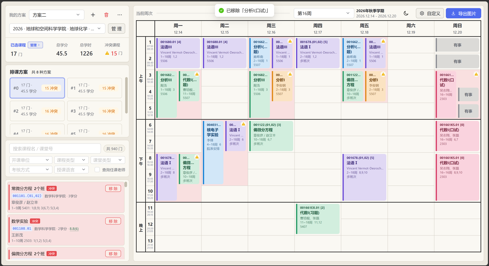
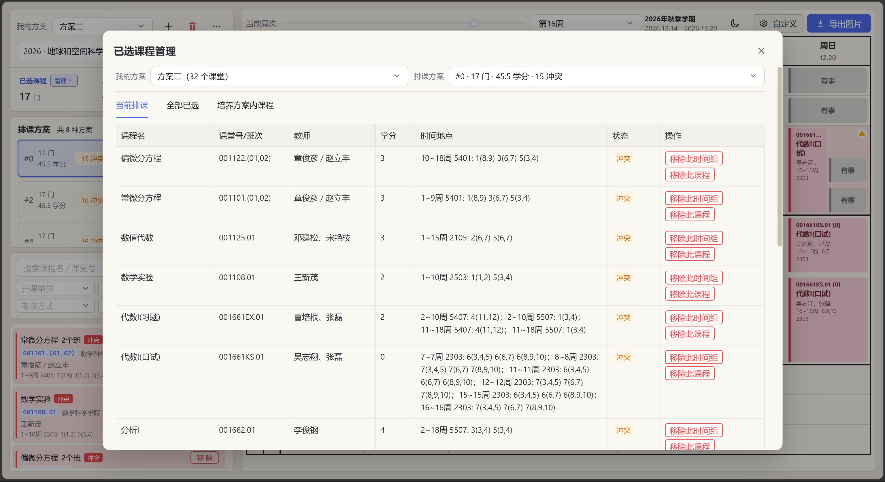
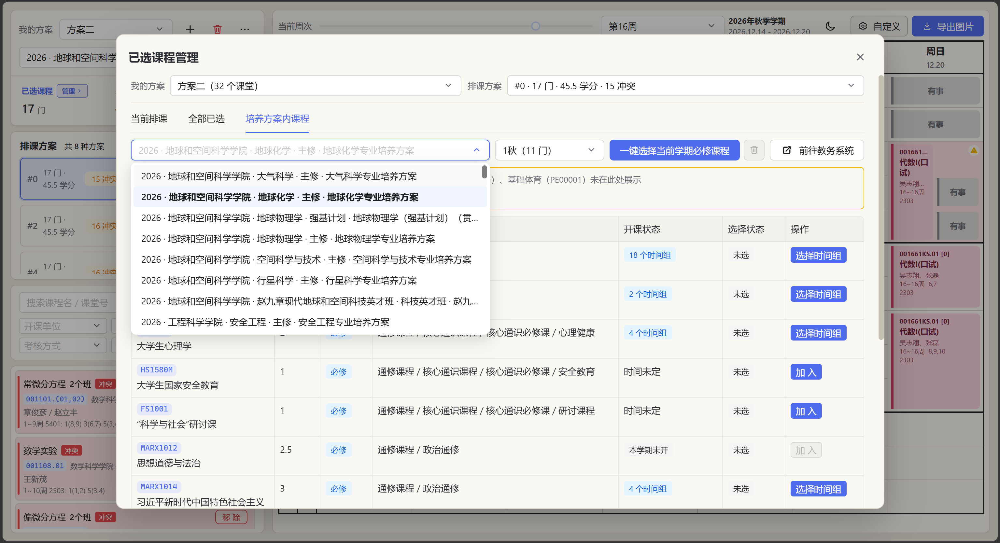
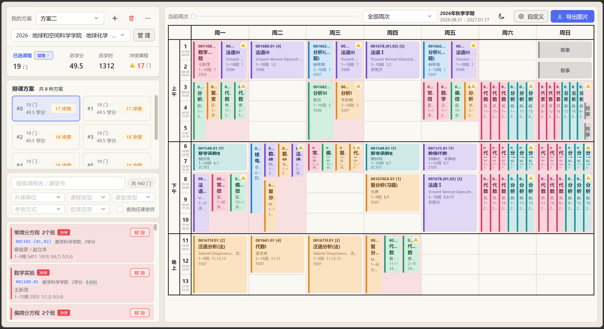

# class-arrange · 中国科大排课协助

一个帮助 USTC 学生在线排课的轻量前端。每学期从教务系统同步开课与课堂详情 →
生成独立的 `courses.json` → 浏览器只加载当前学期数据，按多维度筛选、时间冲突检测生成可视化课表，并支持 icourse.club
评分查询（多班次各自评分）以及教务系统培养方案辅助选课。

## 界面预览

### 单周课表



### 已选课程管理



### 培养方案内课程



### 全部周次与高密度冲突



> 上图刻意叠加了大量同一时间段的课程和自定义占位，属于正常选课中不容易遇到的边界情况；项目仍尽量保证真实节次跨度、课程色条、冲突警告和单元格边界都能正确呈现。

---

## 功能

- **课程池**：按开课单位、课程类型、课堂类型、考核方式、评分制、授课语言筛选；默认搜索课程名 / 课堂号，可按需启用任课老师搜索
- **虚拟滚动列表**：课程卡顿问题通过 `react-window` 的 `List` + `useDynamicRowHeight` 动态行高彻底解决
- **冲突检测**：自动检测课程之间、课程与自定义"有事"时段之间的冲突，并在课表和课程列表中同步标记
- **真实节次布局**：混合时长课程按实际节次占位；桌面端使用冲突轨道，移动端展示包含关系和完整时间色条
- **周课表与校历**：按节次（1–13）×星期（周一至周日）渲染，显示学期、周次、日期、节假日和补课提示；全部周次视图按标准教学周展示
- **已选课程管理**：集中查看当前排课、全部已选和培养方案内课程，可按时间组或整门课程移除、补选、批量移除
- **培养方案辅助**：切换培养方案和学期，查看必修课程及可选时间组，支持一键加入当前学期必修课、清除一键新增的课堂，并跳转到教务系统核查原始方案
- **排课枚举**：当一门课选了多个不同 group 时，自动枚举所有可能的排课组合，按冲突数从少到多列出方案（数量上限可在「自定义」中选 2 / 4 / 8 / 12 / 16），课表与状态栏默认显示冲突最少的一种，可在小卡片间切换；面板还能「显示全部不冲突方案」
- **多方案**：本地保存多个选课方案，并按学期完全隔离
- **方案分享**：把当前学期的选课方案生成无后端快照链接；接收方可预览并导入仍然有效的课堂，链接不包含占位时段或排课偏好
- **自定义占位**：标记固定"有事"时段（按节次粒度），并将其纳入冲突统计和排课排序
- **排课倾向**：在新手引导中可选择"优先空出半天"和"优先减少早八天数"，与冲突数共同影响方案排序
- **本地持久化**：方案数据、培养方案选择、自定义设置、新手引导状态存 `localStorage`，刷新不丢失
- **图片导出**：导出完整课表图片，导出内容固定使用适合分享和打印的亮色样式
- **响应式界面**：课表工具栏、筛选器、详情页和冲突卡片适配桌面与移动端
- **明暗主题**：跟随系统 + 手动切换，使用浏览器 View Transition API 在切换时保留布局
- **新手引导**：首次进入自动弹出偏好向导与分步 Spotlight Tour，介绍方案、排课、培养方案、占位时间等核心功能，可随时在"自定义"中重新查看
- **icourse 评分**：卡片与详情弹窗内显示每门课的 icourse.club 评分（同时间不同老师各自展示，可选评分人数）
- **收藏**：可收藏选课方案、排课方案、课程时间组、具体课堂四类对象，按学期独立持久化；收藏的排课方案在排序中优先靠前，并优先包含更多收藏课程
- **更新感知**：访问时自动弹「最近更新」，含网站版本日志、本学期课程增删改、以及受影响的个人方案（被删课堂自动移除并给出替换候选、教师/时间/地点变化逐项提示）；可在「自定义」中查看完整更新记录、关闭非关键弹窗（被删课堂警告始终保留）
- **校区规避**：排课倾向可设置常驻校区（本部 / 高新区），将跨校区切换作为方案排序的并列因素
- **自动 / 手动排课**：自动模式下输入变化即时重算；手动模式保留当前课表直到手动点击「开始排课」
- **显示全部不冲突方案**：排课面板可懒加载枚举所有零冲突组合，方案数量上限可在「自定义」中选 2 / 4 / 8 / 12 / 16

---

## 技术栈

| 类别 | 选型 |
|---|---|
| 框架 | React 19 + TypeScript 6 |
| 构建 | Vite 8 |
| UI 库 | Ant Design 6 |
| 虚拟滚动 | react-window 2.x（`List` + `useDynamicRowHeight`） |
| 状态 | React Context + `useReducer` |
| 排课引擎 | Web Worker（`src/workers/`），主线程不卡顿；不可用时退化为同步 |
| 校历 / 周次 | `src/config/termCalendar.ts`（含节假日 / 补课映射） |
| 主题切换 | 浏览器 View Transition API + 手动降级 |
| Python 数据脚本 | uv + openpyxl / requests / tqdm / playwright / pytest |

---

## 项目结构

```
class-arrange/
├── LICENSE                      # 项目许可证（非商用）与第三方 AGPL v3 代码说明
├── COPYING                      # GNU AGPL v3 全文（供 icourse_spider 衍生代码）
├── index.html
├── package.json                 # 前端依赖（pnpm）
├── pnpm-workspace.yaml          # esbuild allowBuilds 配置
├── pnpm-lock.yaml
├── pyproject.toml               # Python 依赖（uv）
├── tsconfig*.json
├── vite.config.ts
├── vitest.config.ts
│
├── docs/
│   └── screenshots/              # README 界面截图
│
├── public/
│   └── data/semesters/           # 已入 git：index.json + 每学期 courses.json / updates.json
│
├── src/
│   ├── App.tsx                   # 应用根、主题、布局、Provider 组装
│   ├── main.tsx                  # 入口：SemesterCatalogProvider → UpdateAwarenessProvider → App
│   ├── data/
│   │   ├── SemesterCatalogContext.tsx  # 学期目录加载/切换/校验 + 加载态 fallback
│   │   ├── semesterCatalog.ts    # manifest / catalog / updates 的 fetch + 校验（schemaVersion=1）
│   │   ├── curricula.ts          # 由 scripts/curricula_to_ts.py 自动生成
│   │   └── icourseRatings.ts     # 由 scripts/ratings_to_ts.py 自动生成
│   ├── types/                    # CourseSection / CourseGroup / ScheduleSlot / Plan / Arrangement / Favorites / Updates
│   ├── components/               # 课程池 / 课表 / 弹窗 / 筛选 / 方案 / 收藏 / 更新提示等 UI
│   │   └── onboarding/           # OnboardingWizard / SpotlightTour / TourCard
│   ├── onboarding/               # useOnboarding hook + tourSteps
│   ├── config/                   # termCalendar（学期、节假日、补课）+ 单测
│   ├── hooks/                    # useFilteredCourses / useConflicts / useWeekGrid / useArrangementCalculation
│   ├── store/                    # plansContext + plansReducer（按学期命名空间）
│   ├── favorites/                # favorites 收藏存储 + FavoritesContext（方案/排课/时间组/课堂）
│   ├── updates/                  # 更新感知 + 方案对账 + APP_RELEASES 更新日志
│   ├── workers/                  # arrangement.worker + arrangementProtocol（排课在 Web Worker 中跑）
│   ├── utils/                    # arrangement* / conflict / courseGroup / campusTransfers / customization /
│   │                             #   icourseRating / curriculum / exportPrint / planSeed / schedule* / stats 等
│   ├── constants/                # grid / filterOptions
│   └── styles/                   # tokens / print
│
├── scripts/
│   ├── sync_semester_courses.ps1 # 登录后同步一个或多个学期，成功后自动 validate-lessons --all
│   ├── excel_to_ts.py            # 旧版 Excel 转换工具（仅兼容历史流程，非主数据流）
│   ├── curricula_to_ts.py        # 培养方案 index → src/data/curricula.ts
│   └── ratings_to_ts.py          # icourse 评分 JSON → src/data/icourseRatings.ts
│
├── icourse_spider/               # icourse.club 评分爬虫（学长遗产，AGPL v3）
│   ├── spider.py                 # 8 进程爬取课程名 + 教师 + 评分
│   ├── lesson_match.py           # 匹配 key 工具（name + '#' + sorted(teachers)）
│   └── course_rating.json        # 爬取的最新评分数据（被 git 跟踪）
│
└── catalog_spider/               # USTC 培养方案 + 学期开课爬虫（详见 catalog_spider/README.md）
    ├── __main__.py               # CLI 入口：8 个子命令（见下）
    ├── client.py                 # 培养方案爬取 HTTP 客户端（10 次重试 + 浏览器 UA，无鉴权）
    ├── tree.py / details.py / process.py / paths.py   # 培养方案侧
    ├── lesson_sync.py            # 学期开课同步：Playwright 登录 + 3 个 API + 事务发布
    ├── lesson_transform.py       # 课堂/详情归一化、时间表解析、目录构建与校验
    ├── course_updates.py         # revision 内容哈希 + diff，生成 updates.json
    ├── semester_calendar.py      # 周数计算 + CALENDAR_OVERRIDES 节假日/补课
    ├── tests/                    # 7 个文件、97 个 pytest 用例
    └── data/                     # raw + index（不入 git）
```

`catalog_spider` 的 8 个子命令：培养方案侧 `fetch-tree` / `fetch-details` / `build-index` / `build-by-term` / `all`；学期开课侧 `sync-lessons` / `build-lessons` / `validate-lessons`。详见 [`catalog_spider/README.md`](catalog_spider/README.md)。

---

## 快速开始

> 环境要求：[Node.js](https://nodejs.org/) 22+、`pnpm` 11+、`uv`（[Astral](https://docs.astral.sh/uv/)）、Python 3.12+。

### 1. 安装前端依赖

```powershell
pnpm install
```

### 2. 安装 Python 依赖（用于数据脚本和爬虫）

首次安装同时拉取数据脚本与 icourse 爬虫依赖：

```powershell
uv sync --group spider --group dev
```

> 包含：
> - `openpyxl`：把开课 Excel 转成 TS（`scripts/excel_to_ts.py`，仅历史流程）
> - `playwright`：`catalog_spider` 的 `sync-lessons` 登录同步（USTC CAS/SSO）
> - `requests`、`tqdm`：`icourse_spider` 评分爬虫与 `catalog_spider` 培养方案爬取
> - `pytest`：运行 `catalog_spider/tests` 中的单元测试

仅装数据脚本依赖（不开爬虫）：

```powershell
uv sync
```

### 3. 启动开发服务器

```powershell
pnpm dev
```

浏览器打开 <http://localhost:5173>。

### 4. 其它常用命令

```powershell
pnpm build         # 生产构建（含 tsc 类型检查）
pnpm lint          # oxlint
pnpm test          # Vitest 单元测试
pnpm preview       # 本地预览生产构建
```

---

## 数据更新流程

### 更新学期开课与课堂详情

首次使用先安装抓取依赖；以后每学期只运行同步脚本：

```powershell
uv sync --group spider --group dev
./scripts/sync_semester_courses.ps1 `
  -Semester '2026年秋季学期','2026年夏季学期' `
  -Activate '2026年秋季学期'
```

脚本会打开可见浏览器并完成一次登录。教务系统（`catalog.ustc.edu.cn`）走 USTC 统一身份认证，学期列表 / 课堂列表 / 课堂详情接口对零 cookie 请求返回 401（2026-07 校外实测），因此**首次运行必须手动登录一次**；登录会话保存在已忽略的专用 profile 中，后续运行可直接复用。抓取按 50 个课堂一批保存断点，失败后重跑只补缺失详情。同步成功后脚本自动跑 `validate-lessons --all` 校验全部已发布学期。

每个学期发布为单独文件（均已入 git）：

```text
public/data/semesters/index.json                       # manifest：defaultSemester + 每学期 key/name/file/revision/updatesFile
public/data/semesters/2026-fall/courses.json           # 课程列表 + detailsBySection + revision
public/data/semesters/2026-fall/updates.json           # 与上一版的 added/removed/modified 变更记录
public/data/semesters/2026-summer/courses.json
public/data/semesters/2026-summer/updates.json
```

`courses.json` 同时包含课程列表和 `detailsBySection`。前端先读取轻量索引，用户选择哪个学期才加载哪个学期文件；方案也存入对应学期的独立命名空间。`updates.json` 由 `course_updates.py` 对比上一版生成（内容哈希 `revision` 不变则不追加），供前端「最近更新」提示与方案对账使用。

旧版 `scripts/excel_to_ts.py` 仅保留作历史数据兼容工具，不再是网站的主数据流程。

### 更新培养方案

> 培养方案每个学期可能微调，建议每学期开学跑一次。

```powershell
# 1. 抓取最新数据（首次 setup 或教务系统更新时执行）
uv run python -m catalog_spider all

# 2. 生成前端 TS
uv run python scripts/curricula_to_ts.py
```

> 培养方案的 raw / index **不入 git**：clone 后 `catalog_spider/data/` 为空，需先跑 `all`（即 `fetch-tree` + `fetch-details` + `build-index` + `build-by-term`）抓取一次；只有 `curricula.ts` 生成结果入 git。已抓过且仅改转换规则时，可只跑 `build-index` / `build-by-term` / `curricula_to_ts.py`。
>
> 爬取范围：**仅 `grade >= 2023` 的培养方案**（详见 `catalog_spider/details.py:MIN_GRADE`）。

更细粒度控制和 schema 说明见 [`catalog_spider/README.md`](catalog_spider/README.md)。

### 更新 icourse 评分

> 评分数据每学期变化不大，建议新学期开始时跑一次，平时不必。

```powershell
# 1. 爬取最新评分（约 30 分钟）
uv run python icourse_spider/spider.py

# 2. 转换为前端数据
uv run python scripts/ratings_to_ts.py
```

`ratings_to_ts.py` 按 section（课堂号）维度精确匹配：

```
key = courseName + '#' + ','.join(sorted(teachers))
```

未在 icourse 上出现的课不会出现在 `icourseRatings.ts` 里，前端对应位置不显示任何评分。

> **注意**：`ratings_to_ts.py` 读取 `src/data/courses.ts`（由历史流程 `excel_to_ts.py` 从开课 Excel 生成，当前已不维护、不入 git）。因此这条路径目前依赖历史 Excel；新的主数据流是 `catalog_spider sync-lessons` 产出的 `public/data/semesters/*/courses.json`。除非你手里有当学期 Excel，否则一般无需重跑评分转换。

---

## 关键设计决策

### 选课单元（CourseGroup）

把"同课程号 + 时间完全一致"的多个班次合并成一个 `CourseGroup` 对象。学生排课时不纠结老师，同时间同课的不同班次视为同一选课对象。同课程号但时间不同的班次各自独立成组。

> **评分例外**：评分按 section（课堂号）单独匹配——同时间不同老师各有各的评分。卡片上仅单班次组显示评分，多班次组在详情弹窗"班次明细"表里逐行展示。

### 评分未命中策略

未命中的课**不显示任何东西**（不留"暂无"占位），避免视觉噪声。

### 排课方案枚举

学生同时选了同一门课的多个 group（比如 MATH1006 的两个时间不同的 group），视为"还没决定上哪个老师"，系统进入排课枚举态。排课在 **Web Worker** 中执行（`src/workers/arrangement.worker.ts` + `arrangementProtocol.ts`），主线程不卡顿；Worker 不可用时（如测试）退化为同步执行。

1. 把每个 courseCode 的可选 group 划分为「锁定」（只有一组）和「待定」（多组各选其一），对「待定」做组合搜索（`src/utils/arrangementEngine.ts:enumerateArrangementsExact`）
2. 用预计算的周-日-分钟区间 + 增量增删维护冲突计数，避免对每个组合重算
3. 用容量受限的最大堆保留前 N 个候选（N 由「自定义」中的方案数量上限决定，可选 2 / 4 / 8 / 12 / 16）
4. 排序键（`compareArrangementRanks`）：已收藏的方案 → 冲突更少 → 含更多收藏课程 →（可选）校区切换更少 →（可选）空半天分更高 →（可选）早八更少 → 字典序 → 学分更多
5. 默认应用排名第一的方案；用户点击 `ArrangementPanel` 小卡片可切换；面板可懒加载「显示全部不冲突方案」（第二个 Worker 调用，枚举所有零冲突组合）
6. 课表、状态栏只看当前应用的方案——恰好"一门课一格"，`已选课程` 不重复计数同课多 group

### 排课倾向与占位时间

`src/utils/customization.ts` 中的 `CustomScheduleSettings` 把"用户偏好"显式持久化：

- `preferHalfDay` / `preferFewerEarlyMornings` / `preferAvoidCampusTransfers` + `residentCampus` —— 由新手引导选择，影响方案排序
- `blockedSlots` —— "有事"时段，按 `day-period` 字符串存储，纳入冲突统计
- `calculationMode` —— 自动 / 手动是否即时重算
- `arrangementDisplayCount` —— 推荐方案数量上限（2 / 4 / 8 / 12 / 16）
- `mergeAllTimeGroups` —— 课程池中把同一门课的多个时间组合并成一张卡片（仅显示，不影响选课/冲突/排课）

### 周次与校历

- 单周视图保留 `src/config/termCalendar.ts` 中维护的校历日期、节假日和补课提示
- `全部周次` 视图只看原始开课周次和星期，不套用调休、节假日或日期变更，便于快速判断课程本身的常规节奏
- 切换学期时只替换 `TERM_CALENDAR` 对象（`termId` / `termName` / `weekStartDate` / `weekCount` / `holidays` / `makeupDays` / `sourceUrl`）

### 冲突课表布局

课表以课程真实节次为布局依据，而不是把同一冲突组平均切块：

1. 桌面端按时间重叠关系分配轨道，短课程和普通卡片保持同样高度；高密度轨道会逐步收紧间距，并限制在所属单元格内
2. 移动端保留完整时间背景和 4px 课程色条，较短时间段可显示在较长时间段的背景内部
3. 冲突底色单独放在最底层，课程卡片、色条、"有事"占位和警告图标使用独立层级，避免颜色互相污染

极端情况下，同一天同一时间可能出现很多不同周次、不同课程和自定义占位。此类组合在正常使用中很少出现，但布局算法仍会优先保证时间跨度和边界正确，再对文字做省略处理。

### 性能

- 课程池用 `react-window` 的 `List` + `useDynamicRowHeight`，动态行高只在父组件关键依赖变化时重算
- 评分查询是 `Record<string, rating>` 的 O(1) 查表，没有运行时开销
- 颜色用模块级两级 Map 缓存，避免重复 hash
- `usePlans` 通过 200ms debounce 写回 `localStorage`，避免每次 reducer 都触发 IO

---

## 常见问题

### 浏览器打开是空白

- 检查控制台是否有 `Failed to load module`
- 重新 `pnpm install`，删除 `node_modules/.vite` 缓存后 `pnpm dev`

### Excel 时间地点解析失败

`scripts/excel_to_ts.py` 会在输出里打印前 20 条失败样本。如果是大面积失败，多半是 Excel 里时间地点字符串格式与预期差异较大；可以提 issue 并附原始字符串。

### 评分覆盖率低

部分课在 icourse 上确实没有评分（老师没开评课），属正常现象。

### 想改主题色

编辑 `src/styles/tokens.css`，所有颜色都通过 CSS 变量管理；暗色模式的 Ant Design tokens 在 `src/App.tsx: DARK_ANTD_THEME_TOKENS`。

### 想换学期

替换 `src/config/termCalendar.ts: TERM_CALENDAR` 的 `termId` / `termName` / `weekStartDate` / `weekCount` / `holidays` / `makeupDays` / `sourceUrl`，无需改其它代码。

---

## 开发者约定

- `package.json`/`pnpm-lock.yaml` 用 pnpm 管理前端依赖
- `pyproject.toml`/`uv.lock` 用 uv 管理 Python 依赖
- 前端不用 ESLint，用 oxlint（更快）
- TypeScript 启用 `verbatimModuleSyntax`、`noUnusedLocals`、`noUnusedParameters`、`erasableSyntaxOnly`、`noFallthroughCasesInSwitch`（未开全局 `strict`）
- 前端测试用 Vitest（`pnpm test` / `pnpm test:watch`），Python 爬虫 / 工具用 pytest（`uv run pytest catalog_spider/tests -v`）
- 功能更新时同步完善 `src/updates/appUpdates.ts` 中的 `APP_RELEASES` 更新记录
- 提交前跑 `pnpm tsc -b && pnpm lint` 确保通过

---

## License

许可证与第三方来源说明见 [`LICENSE`](LICENSE)（项目主体为非商用许可证，`icourse_spider` 衍生代码为 AGPL v3），AGPL v3 全文见 [`COPYING`](COPYING)。

其中 `icourse_spider/spider.py` 与 `icourse_spider/lesson_match.py` 来自
`https://github.com/feixukeji/paike`，原项目许可证为 AGPL v3；相关来源也写在文件顶部注释中。
